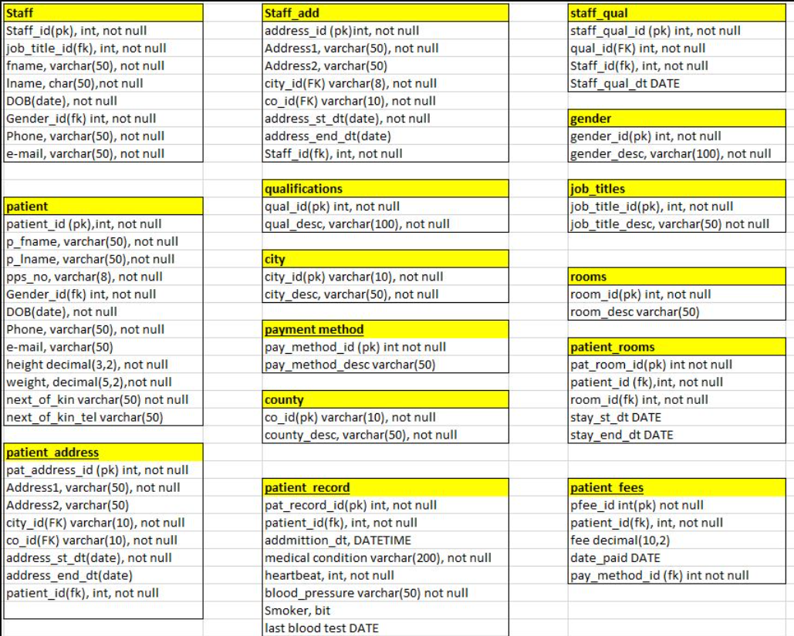

# Hospital Admissions Database

### A database project to showcase patient and staff record

This is a data analysis project for Cenit College's Data analysis course. This project is made with the use of **SQL** and **SQL sever management studio**
## **Table of Content**
* Overview
* Database Model

***
## **Overview**
Hospital admission database is an data manupulation and extraction project which interacts with Hospital admission database and show the records of patients and employees.

## **Database Model**
Microsoft SQL server management studio is used for the project 

